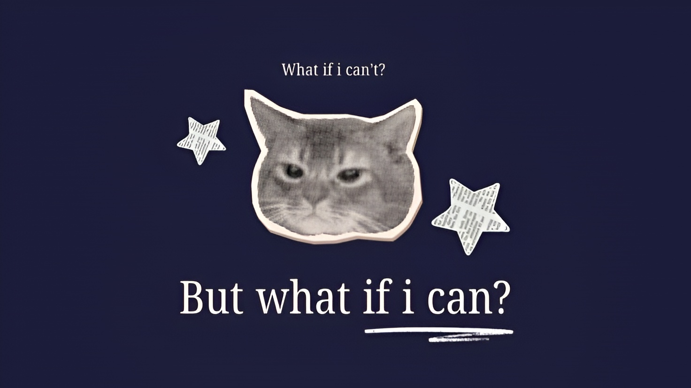

  

 

  
  
<i>Crafting intuitive web experiences and exploring the intersection of software and hardware.</i>

---

<h2 align="center">🚀 Currently Working On</h2>

<table>
  <tr>
    <td align="center" width="130">
      <!-- Replace the link below with your actual EcoPoints logo URL -->
      
    </td>
    <td>
      <h3>EcoPoints</h3>
      
An IoT-integrated reverse vending machine prototype for automated PET waste management and rewards. Bridging web interfaces with physical hardware.

      

        <code>React</code> 
        <code>PostgreSQL</code> 
        <code>Python</code> 
        <code>Raspberry Pi</code>
      

    </td>
  </tr>
</table>

 

<h2 align="center">🛠️ Tech Tools & Workflow - Still Learning</h2>

  

 

<h2 align="center">📫 Socials - Connect with Me</h2>

  
  
  

 
